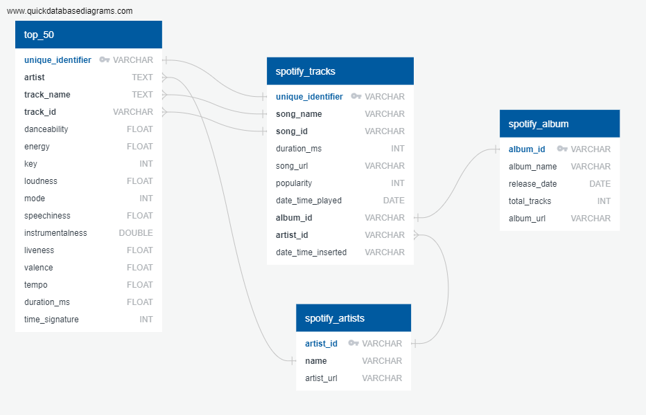

# ETL Project - Spotify
Spotify ETL project utilizing the Spotipy python library with the Spotify API. We will extract, transform, and load the data into the database using Python, then use the SQLAlchemy library to load it into PostgreSQL. We will also automate this process using Apache Airflow and schedule a weekly summary review e-mail.

## Extract: Spotify API using Spotipy Library
Extract data from Spotify API to hit "current_user_recently_played" and "daily top 50 songs global" endpoints. Each endpoint will get 50 songs maximum. The results are stored in lists and dictionaries of lists.

## Transform: Python and Pandas
Next, the data should be transformed into Pandas dataframes after being cleaned. To make the data usable, we will remove duplicates and add unique IDs to the songs. Then the two two endpoints will be merged together. 

## Load: SQLAlchemy and PostgreSQL
The final database will be loaded onto a PostgreSQL server using SQLAlchemy. We created tables using SQL to hold the Spotify data.  

## Automation: Apache Airflow